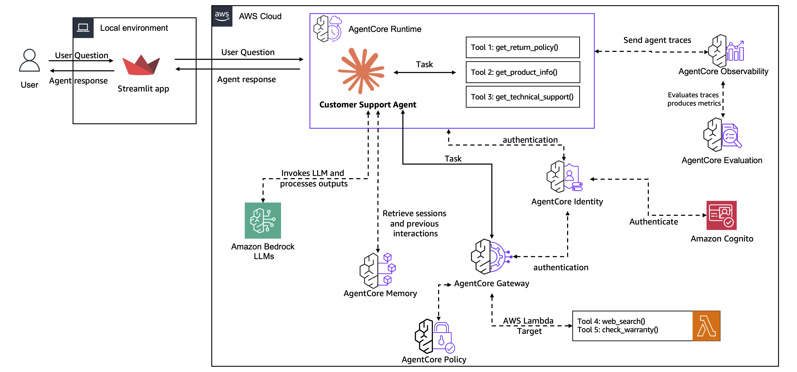

# End-to-End Customer Support Agent with Claude Agent SDK on Bedrock AgentCore

Build and deploy a production-grade Customer Support Agent using the **Claude Agent SDK** (`claude-agent-sdk`) on **Amazon Bedrock AgentCore**.

## Architecture

This project demonstrates a progressive journey from local prototype to production deployment:

1. **Lab 1 - Create Agent Prototype**: Build a functional customer support agent with Claude Agent SDK tools and MCP servers
2. **Lab 2 - Add AgentCore Memory**: Integrate persistent memory for personalized multi-user support
3. **Lab 3 - Scale with Gateway**: Centralize tools via AgentCore Gateway using MCP protocol
4. **Lab 4 - Deploy to Runtime**: Deploy to AgentCore Runtime as a production Flask server
5. **Lab 5 - Online Evaluations**: Set up continuous quality monitoring with built-in evaluators
6. **Lab 6 - Build Frontend**: Create a Streamlit web app with Cognito authentication
7. **Lab 7 - Cleanup**: Remove all AWS resources

<div style="text-align:left">
    
</div>

## Key Technologies

| Component | Technology |
|-----------|-----------|
| Agent Framework | Claude Agent SDK (`claude-agent-sdk`) |
| Model | Anthropic Claude Haiku 4.5 via Amazon Bedrock |
| Tools | `@tool` decorator + MCP servers |
| Memory | Amazon Bedrock AgentCore Memory |
| Gateway | Amazon Bedrock AgentCore Gateway (MCP protocol) |
| Runtime | Flask server on AgentCore Runtime (port 8080) |
| Auth | Amazon Cognito (JWT) |
| Frontend | Streamlit |
| Observability | AWS CloudWatch + OpenTelemetry |

## Claude Agent SDK vs Strands Agents

| Aspect | Strands Agents | Claude Agent SDK |
|--------|---------------|-----------------|
| Agent invocation | `Agent(model, tools)(prompt)` | `query(prompt, options)` |
| Tool definition | `@strands.tools.tool` | `@claude_agent_sdk.tool` |
| MCP integration | `MCPClient` wrapper | Native `mcp_servers` config |
| Memory hooks | `HookProvider` callbacks | Manual retrieve/save around `query()` |
| Runtime server | `BedrockAgentCoreApp` | Flask on port 8080 |
| Bedrock backend | `BedrockModel` class | `CLAUDE_CODE_USE_BEDROCK=1` env var |
| Built-in tools | None | Bash, Read, Write, Edit, Glob, Grep, WebSearch |
| Skills | None | `.claude/skills/*.md` |

## Claude Agent SDK Patterns

### Tool Definition

Tools must accept a **single `args` dict** and return a **dict** (not a JSON string):

```python
from claude_agent_sdk import tool

@tool(
    name="get_return_policy",
    description="Get return policy for a product category.",
    input_schema={
        "type": "object",
        "properties": {
            "product_category": {"type": "string", "description": "Product category"}
        },
        "required": ["product_category"],
    },
)
async def get_return_policy(args):
    category = args["product_category"]
    return {"content": [{"type": "text", "text": f"Policy for {category}: ..."}]}
```

### AsyncIterable Prompt Pattern

When using SDK MCP servers (in-process tools), prompts must be wrapped as an `AsyncIterable` to maintain bidirectional stdin communication with the CLI subprocess:

```python
from agent import prompt_stream

async for msg in query(prompt=prompt_stream(user_input), options=options):
    if hasattr(msg, "result"):
        print(msg.result)
```

The `prompt_stream()` helper (in `agent/__init__.py`) wraps a string as an async generator. This is required because string prompts close stdin immediately, breaking the control protocol for SDK MCP servers.

### External MCP Server (Gateway)

AgentCore Gateway connections use `"type": "http"`:

```python
gateway_config = {
    "type": "http",  # NOT "url" or "sse"
    "url": gateway_url,
    "headers": {"Authorization": f"Bearer {jwt_token}"},
}

options = ClaudeAgentOptions(
    mcp_servers={
        "customer-support": sdk_server,      # In-process
        "agentcore-gateway": gateway_config,  # External
    },
)
```

## Prerequisites

- AWS Account with Bedrock model access (Claude Haiku 4.5)
- Python 3.11+
- Docker (for runtime deployment)
- AWS CLI configured

## Getting Started

### 1. Create virtual environment and install dependencies

```bash
python -m venv .venv
source .venv/bin/activate
pip install -r requirements.txt
```

### 2. Deploy prerequisite infrastructure

```bash
cd scripts
bash prereq.sh
```

### 3. Set Bedrock environment

```bash
export CLAUDE_CODE_USE_BEDROCK=1
```

### 4. Run the labs

Open the Jupyter notebooks in order (lab-01 through lab-07) and follow the instructions.

## Project Structure

```
claude-agent-sdk-bedrock-agentcore-e2e/
├── README.md                            # This file
├── CLAUDE.md                            # Instructions for Claude Code
├── requirements.txt                     # Python dependencies
├── .gitignore                           # Git exclusions
├── .dockerignore                        # Docker build exclusions
├── .claude/
│   ├── settings.json                    # MCP server configs
│   └── skills/                          # Claude Agent SDK skills
│       ├── customer-support.md          # Domain knowledge
│       ├── deploy-to-agentcore.md       # Deployment procedures
│       └── troubleshoot.md              # Debugging guides
├── lab-01 through lab-07.ipynb          # Progressive lab notebooks
├── agent/                               # Agent module
│   ├── __init__.py                      # prompt_stream() helper
│   ├── tools.py                         # Customer support tools (@tool)
│   ├── mcp_server.py                    # In-process MCP server
│   ├── memory_hooks.py                  # AgentCore Memory integration
│   ├── gateway_client.py               # AgentCore Gateway MCP client
│   └── prompts.py                       # System prompts and model config
├── runtime/                             # Production runtime
│   ├── app.py                           # Flask server (port 8080)
│   ├── Dockerfile                       # Container image
│   └── entrypoint.sh                    # Container entrypoint
├── frontend/                            # Streamlit web app
│   ├── main.py                          # App entry point with Cognito auth
│   ├── chat.py                          # ChatManager for streaming
│   ├── chat_utils.py                    # URL formatting utilities
│   └── requirements.txt                 # Frontend dependencies
├── prerequisite/                         # CloudFormation infrastructure
│   ├── infrastructure.yaml              # DynamoDB, Lambda, IAM
│   ├── cognito.yaml                     # Cognito User Pool
│   └── lambda/                          # Lambda function code
├── scripts/                             # Setup and cleanup scripts
│   ├── prereq.sh                        # Deploy prerequisites
│   ├── cleanup.sh                       # Remove all resources
│   └── list_ssm_parameters.sh           # List stored parameters
├── utils/                               # AWS utility functions
│   └── aws_helpers.py                   # SSM, Cognito, IAM helpers
└── images/                              # Architecture diagrams
```

## Security

- No credentials are hardcoded in source code
- All secrets are stored in AWS SSM Parameter Store and Secrets Manager
- JWT tokens are obtained dynamically via Amazon Cognito
- The `.bedrock_agentcore.yaml` file (auto-generated, contains account-specific config) is excluded from git

## Cleanup

Run Lab 7 notebook or execute:

```bash
cd scripts
bash cleanup.sh
```
